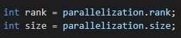
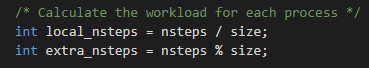
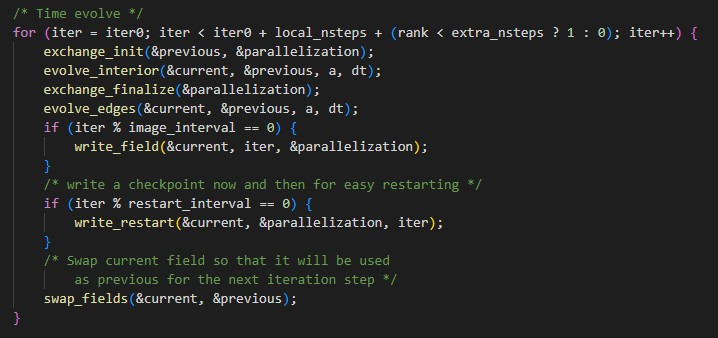
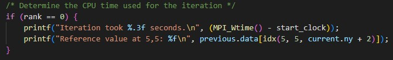

# Descripción del programa 
Este repositorio corresponde a una versión mejorada de una solución propuesta para un curso de MPI realizado por PRACE para la ecuación de calor bidimensional, dicha solución esta realizada en MPI con C. A continuación se dara una descripción de cada uno de los archivos que hace parte de esta solución: 
- **core.c**: contiene funciones esenciales para resolver la ecuación de calor en un entorno de procesamiento paralelo utilizando MPI. Las funciones se encargan de intercambiar valores en los bordes del dominio y actualizar los valores de temperatura en el interior y en los bordes del dominio en cada paso de tiempo.
- **heat.h**: proporciona las definiciones y prototipos necesarios para la implementación del programa de simulación de la ecuación de calor. Define las estructuras de datos y funciones que se utilizan en el programa principal para llevar a cabo la simulación de difusión de calor en un dominio de dos dimensiones.
- **io.c**: contiene funciones para la entrada y salida de datos utilizadas en el programa de simulación de la ecuación de calor. Estas funciones permiten cargar datos iniciales desde archivos, escribir imágenes de la distribución de temperatura y crear puntos de reinicio para continuar la simulación desde un estado anterior.
- **main.c (código principal)**: es el archivo principal del programa de resolución de la ecuación de calor en 2D. Realiza la simulación de la ecuación de calor en 2D y realiza la salida de datos, incluyendo imágenes y puntos de reinicio, en intervalos específicos.
- **pngwriter.c**: permite la generación de imágenes PNG a partir de matrices de datos y es útil para visualizar resultados numéricos en aplicaciones científicas y de procesamiento de imágenes. La función cmap se encarga de asignar colores a los valores de los datos, y la paleta de colores se define en la matriz heat_colormap.
- **pngwriter.h**: es un archivo de encabezado que se utiliza para declarar la función save_png, la cual permite para guardar datos en formato PNG.
- **setup.c**: proporciona una serie de funciones para inicializar, configurar y finalizar la simulación de la ecuación del calor en un entorno de procesamiento paralelo. Además, gestiona la lectura de archivos de entrada y permite la reanudación de simulaciones a partir de un punto de control anterior. Este código es una parte esencial de la preparación de la simulación antes de ejecutarla en un entorno paralelo.
- **utilities.c**: proporciona una serie de funciones de utilidad para gestionar la asignación de memoria, copia y asignación de campos de temperatura. Estas funciones son esenciales para la manipulación eficiente de datos y la gestión de memoria en el programa general.
- **Makefile**: se utiliza para compilar y vincular el programa "heat_mpi" a partir de varios archivos fuente, incluidos "core.c", "setup.c", "utilities.c", "io.c" y "main.c", que forman parte de la solución para la ecuación de calor. El programa se compila con optimización y se vincula con las bibliotecas necesarias, como "libpng" y "libm".
- **bottle.dat**: ilustra lo que le sucede a una botella de refresco fría que se somete a temperaturas externas. 

# Modificaciones realizadas
En el código 

En la ejecución y en la compilación
# Instrucciones de compilación y ejecución 
Modo interactivo
Modo pasivo
# Resultados obtenidos 
Código original 
Código modificado 
Código modificado con mejoras en la ejecución y compilación 
# Conclusiones

