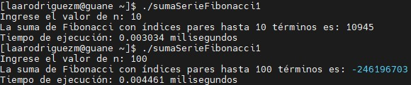
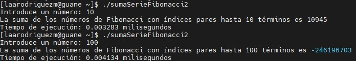

# Descripción de la actividad

El siguiente repositorio tiene como objetivo resolver el siguiente problema: realizar un programa en C para encontrar la suma de números de Fibonacci en índices pares de hasta N términos. En el repositorio se encuentran los siguientes archivos: 
- **sumaSerieFibonacci1.c**: calcula la suma de los números de Fibonacci en índices pares hasta un número n ingresado por el usuario. Incluye una función calculateEvenSum(int n) que calcula la suma de los números de Fibonacci en índices pares hasta n, y una función principal main() que solicita al usuario que ingrese el valor de n, calcula e imprime la suma utilizando la función calculateEvenSum.
- **sumaSerieFibonacci2.c**: calcula la suma de los números de Fibonacci en índices pares hasta un número n ingresado por el usuario utilizando la técnica de programación dinámica. Define una función fib(int n) que calcula el n-ésimo número de Fibonacci utilizando una tabla de memoización, y una función calculateEvenSum(int n) que utiliza la función fib para calcular la suma de los números de Fibonacci en índices pares. En la función principal main(), se solicita al usuario que ingrese el valor de n, se calcula e imprime la suma utilizando la función calculateEvenSum.
- **sumaSerieFibonacci3.c**: calcula la suma de los números de Fibonacci en índices pares hasta un número n ingresado por el usuario utilizando la recursión. Define una función fibo(long n) que calcula el n-ésimo número de Fibonacci de manera recursiva, y una función calculateEvenSum(int n) que utiliza la función fibo para calcular la suma de los números de Fibonacci en índices pares. En la función principal main(), se solicita al usuario que ingrese el valor de n, se calcula e imprime la suma utilizando la función calculateEvenSum.
  
Estos tres primeros, programas solucionan el problema propuesto de forma secuencial con diferentes métodos. El siguiente programa ofrece una solución paralela del problema. 

- **omp_sumaSerieFibonacci.c**: calcula la suma de los números de Fibonacci en índices pares hasta un número n ingresado por el usuario utilizando la recursión y la programación paralela con OpenMP. Define una función fibo(long n) que calcula el n-ésimo número de Fibonacci de manera recursiva. En la función principal main(), se solicita al usuario que ingrese el valor de n, se establece el número de hilos que OpenMP debe usar, y se calcula la suma de los números de Fibonacci en índices pares hasta n utilizando dos hilos separados para calcular los dos últimos números de Fibonacci necesarios para la suma

# Instrucciones de compilación y ejecución

Para compilar y ejecutar el código en el clúster de GUANE-1, siga las siguientes instrucciones: 

1. Copie el código del archivo que desea ejecutar, en este caso, a modo de ejemplo copiaremos el archivo `omp_sumaSerieFibonacci.c`
   
2. Entre en GUANE-1 con sus respectivas credenciales y ejecute el siguiente comando: 
   
  ```
  ssh guane 
  ```
3. Escriba vim seguido por el nombre del archivo (con esto creara el archivo), por ejemplo:
  ```
  vim omp_sumaSerieFibonacci.c
  ```
4. Al abrir el editor de vim, de clic en la letra i para ingresar al modo INSERT y pegue el código anteriormente copiado. Luego de clic a la tecla Esc y escriba el comando :wq para guardar el archivo y salir del editor.


5. Para compilar el archivo ejecute la siguiente instrucción:
  ```
  gcc -Wall -fopenmp omp_sumaSerieFibonacci.c -o omp_sumaSerieFibonacci
  ```
6. Por último para ejecutar el programa, ejecute el siguiente comando:

  ```
  ./omp_sumaSerieFibonacci
  ```


# Comparaciones de tiempos de ejecución 

Para medir el tiempo se utilizo una "n" pequeña (n = 10) y luego una más grande (n = 100) para observar como cambia el tiempo de ejecucion a medida que "n" se hace mas grande. 

#### Tiempos de ejecución para sumaSerieFibonacci1.c



#### Tiempos de ejecución para sumaSerieFibonacci2.c



#### Tiempos de ejecución para sumaSerieFibonacci3.c

#### Tiempos de ejecución para omp_sumaSerieFibonacci.c

# Pseudocódigos

#### Pseudocódigo de sumaSerieFibonacci1.c

1. Inicializar n.
   
2. Solicitar al usuario que ingrese el valor de n.
   
3. Si n es menor o igual a cero, retornar 0.
   
4. Crear un array fibo con tamaño 2n + 1, inicializar fibo[0] en 0 y fibo[1] en 1.
   
5. Inicializar la suma en 0.
   
6. Para i desde 2 hasta 2n (inclusive), hacer lo siguiente:
   
   6.1. Calcular el i-ésimo número de Fibonacci como la suma de los dos números anteriores en la secuencia y almacenarlo en fibo[i].
   
   6.2. Si i es par, agregar fibo[i] a la suma total.
   
7. Retornar la suma total.
   
8. Imprimir "La suma de Fibonacci con índices pares hasta n términos es: " seguido del resultado de la función calculateEvenSum(n).
   
9. Terminar el programa.

#### Pseudocódigo de sumaSerieFibonacci2.c

1. Inicializar un array f de tamaño MAX con todos los elementos en 0.
   
2. Definir la función fib(n) que retorna el n-ésimo número de Fibonacci usando la tabla f[].
   
    2.1. Si n es 0, retornar 0.
     
    2.2. Si n es 1 o 2, retornar 1 y almacenar este valor en f[n].
    
    2.3. Si f[n] ya ha sido calculado, retornar f[n].
    
    2.4. Calcular k como (n + 1) / 2 si n es impar, o n / 2 si n es par.
    
    2.5. Calcular f[n] usando la fórmula (fib(k) * fib(k) + fib(k - 1) * fib(k - 1)) si n es impar, o (2 * fib(k - 1) + fib(k)) * fib(k)    si n    es par. 
    
    2.6. Retornar f[n].
  
3. Definir la función calculateEvenSum(n) que retorna el valor de la suma de los números de Fibonacci con índices pares.

    3.1. Retornar (fib(2 * n + 1) - 1).
  
4. En la función principal del programa:
   
    4.1. Solicitar al usuario que introduzca un número y almacenarlo en n.
    
    4.2. Calcular la suma de los números de Fibonacci con índices pares hasta el término n usando la función calculateEvenSum(n) y           almacenar el resultado en sum.
    
    4.3. Imprimir “La suma de los números de Fibonacci con índices pares hasta n términos es sum”.
    
    4.4 Terminar el programa.

#### Pseudocódigo de sumaSerieFibonacci3.c

1. Definir la función fibo(n) que retorna el n-ésimo número de Fibonacci.
   
    1.1. Si n es 1 o 2, retornar 1.
   
    1.2. Si n es mayor que 2, retornar la suma de los dos números anteriores en la secuencia de Fibonacci, que se calculan llamando a la     función fibo(n - 1) y fibo(n - 2).
   
2. Definir la función calculateEvenSum(n) que retorna el valor de la suma de los números de Fibonacci con índices pares.
   
    2.1. Retornar (fibo(2 * n + 1) - 1).
   
3. En la función principal del programa:
   
    3.1. Solicitar al usuario que introduzca un número y almacenarlo en n.
   
    3.2. Calcular la suma de los números de Fibonacci con índices pares hasta el término n usando la función calculateEvenSum(n) y           almacenar el resultado en sum.
   
    3.3. Imprimir “La suma de los números de Fibonacci con índices pares hasta n términos es sum”.
   
    3.4. Terminar el programa.

#### Pseudocódigo de omp_sumaSerieFibonacci.c

1. Definir la función fibo(n) que retorna el n-ésimo número de Fibonacci.
   
    1.1. Si n es 1 o 2, retornar 1.
   
    1.2. Si n es mayor que 2, retornar la suma de los dos números anteriores en la secuencia de Fibonacci, que se calculan llamando a la          función fibo(n - 1) y fibo(n - 2).
   
2. En la función principal del programa:
   
    2.1. Establecer el número de hilos a 5.
   
    2.2. Solicitar al usuario que introduzca un número y almacenarlo en n.
   
    2.3. Inicializar la variable respuesta en 0.
   
    2.4. Crear dos secciones paralelas:
   
       2.4.1. Sección 1: Calcular el (2n + 1 - 2)-ésimo número de Fibonacci usando la función fibo(), imprimir el resultado y agregarlo a respuesta.
   
       2.4.2. Sección 2: Calcular el (2n + 1 - 1)-ésimo número de Fibonacci usando la función fibo(), imprimir el resultado y agregarlo a respuesta.
   
    2.5. Restar 1 a respuesta.
   
    2.6. Imprimir “La suma de los números de Fibonacci con índices pares hasta n términos es respuesta”.
   
    2.7. Terminar el programa.

# Análisis de complejidad de los algoritmos

#### Análisis de complejidad de sumaSerieFibonacci1.c

- El tiempo de ejecución de la función calculateEvenSum(n) está dominado por el bucle for que se ejecuta 2n veces. Dentro de este bucle, todas las operaciones (cálculo del número de Fibonacci, comprobación de si el índice es par y suma del número de Fibonacci a la suma total) se realizan en tiempo constante. Por lo tanto, la complejidad temporal de esta función es O(n).

- En cuanto a la complejidad espacial, la función calculateEvenSum(n) crea un array fibo de tamaño 2n + 1 para almacenar los números de Fibonacci. Por lo tanto, la complejidad espacial es O(n).

Por lo tanto, este código tiene una complejidad temporal y espacial lineal, es decir, O(n).

#### Análisis de complejidad de sumaSerieFibonacci2.c

- Este código utiliza una optimización conocida como “Fórmula de la serie de Fibonacci” o “Identidad de Cassini”, que permite calcular el n-ésimo número de Fibonacci en O(log n) en lugar de O(n).

- La función fib(n) en este código no calcula todos los números de Fibonacci hasta n. En cambio, utiliza una fórmula para calcular directamente el n-ésimo número de Fibonacci, lo que reduce significativamente el tiempo de ejecución.

Por lo tanto, la complejidad temporal de este código es O(log n).

- En cuanto a la complejidad espacial, aunque se utiliza un array f[] de tamaño MAX para almacenar los números de Fibonacci calculados, en realidad solo se utilizan O(log n) entradas en este array debido a la naturaleza recursiva de la función fib(n). Por lo tanto, la complejidad espacial también es O(log n).

#### Análisis de complejidad de sumaSerieFibonacci3.c

- El tiempo de ejecución de la función fibo(n) está dominado por las llamadas recursivas a fibo(n - 1) y fibo(n - 2). Dado que no hay memoización (es decir, no se almacenan los resultados de los cálculos previos), cada número de Fibonacci se calcula múltiples veces. Por lo tanto, la complejidad temporal de esta función es O(2^n), que es exponencial.

- En cuanto a la complejidad espacial, la función fibo(n) utiliza espacio en la pila para las llamadas recursivas. En el peor de los casos (cuando n es grande), esto puede llevar a una profundidad de recursión de n. Por lo tanto, la complejidad espacial es O(n).

Por lo tanto, este código tiene una complejidad temporal exponencial y una complejidad espacial lineal.

#### Análisis de complejidad de omp_sumaSerieFibonacci.c

- El tiempo de ejecución de la función fibo(n) está dominado por las llamadas recursivas a fibo(n - 1) y fibo(n - 2). Dado que no hay memoización (es decir, no se almacenan los resultados de los cálculos previos), cada número de Fibonacci se calcula múltiples veces. Por lo tanto, la complejidad temporal de esta función es O(2^n), que es exponencial.

- Sin embargo, en la función principal del programa, se utilizan dos secciones paralelas para calcular dos números de Fibonacci diferentes al mismo tiempo. Esto puede reducir potencialmente el tiempo de ejecución a la mitad en un sistema con al menos dos núcleos de CPU, pero no cambia la complejidad temporal exponencial.

- En cuanto a la complejidad espacial, la función fibo(n) utiliza espacio en la pila para las llamadas recursivas. En el peor de los casos (cuando n es grande), esto puede llevar a una profundidad de recursión de n. Por lo tanto, la complejidad espacial es O(n).

Por lo tanto, este código tiene una complejidad temporal exponencial y una complejidad espacial lineal.

### Conclusiones 

Por lo tanto, teóricamente el código mas rápido en ejecutarse serie "sumaSerieFibonacci2.c" y el mas lento "sumaSerieFibonacci3.c". "sumaSerieFibonacci1.c" seria el segundo más rápido y "omp_sumaSerieFibonacci.c" el tercero. 

Si observamos los resultados que obtuvimos al medir los tiempos de ejecución podemos comprobar que estos cumplen con la teoría. A medida que "n" sea mas grande el programa "sumaSerieFibonacci2.c" es el que tiene mejor rendimiento y "sumaSerieFibonacci3.c" es el que tiene peor rendimiento. 

# Comparación de métodos

*....*
