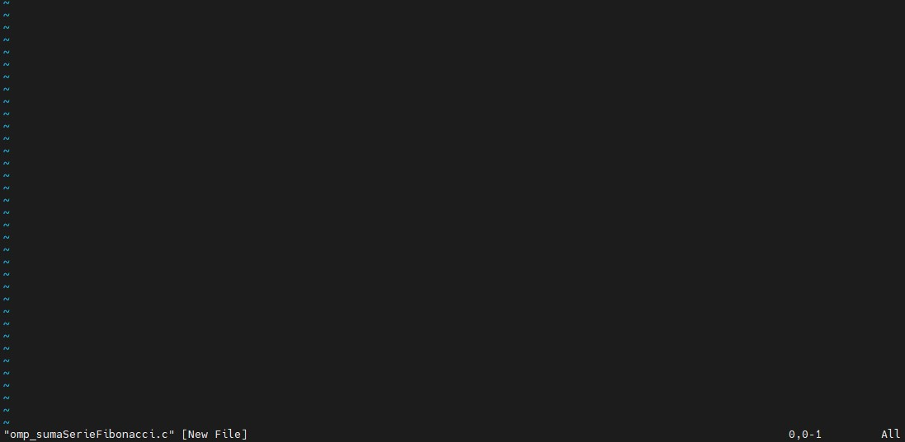
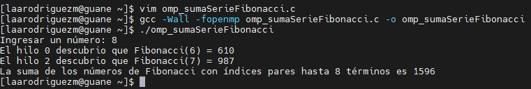

# Descripción de la actividad

El siguiente repositorio tiene como objetivo resolver el siguiente problema: realizar un programa en C para encontrar la suma de números de Fibonacci en índices pares de hasta N términos. En el repositorio se encuentran los siguientes archivos: 
- **sumaSerieFibonacci1.c**: calcula la suma de los números de Fibonacci en índices pares hasta un número n ingresado por el usuario. Incluye una función calculateEvenSum(int n) que calcula la suma de los números de Fibonacci en índices pares hasta n, y una función principal main() que solicita al usuario que ingrese el valor de n, calcula e imprime la suma utilizando la función calculateEvenSum.
- **sumaSerieFibonacci2.c**: calcula la suma de los números de Fibonacci en índices pares hasta un número n ingresado por el usuario utilizando la técnica de programación dinámica. Define una función fib(int n) que calcula el n-ésimo número de Fibonacci utilizando una tabla de memoización, y una función calculateEvenSum(int n) que utiliza la función fib para calcular la suma de los números de Fibonacci en índices pares. En la función principal main(), se solicita al usuario que ingrese el valor de n, se calcula e imprime la suma utilizando la función calculateEvenSum.
- **sumaSerieFibonacci3.c**: calcula la suma de los números de Fibonacci en índices pares hasta un número n ingresado por el usuario utilizando la recursión. Define una función fibo(long n) que calcula el n-ésimo número de Fibonacci de manera recursiva, y una función calculateEvenSum(int n) que utiliza la función fibo para calcular la suma de los números de Fibonacci en índices pares. En la función principal main(), se solicita al usuario que ingrese el valor de n, se calcula e imprime la suma utilizando la función calculateEvenSum.
  
Estos tres primeros, programas solucionan el problema propuesto de forma secuencial con diferentes métodos. El siguiente programa ofrece una solución paralela del problema. 

- **omp_sumaSerieFibonacci.c**: calcula la suma de los números de Fibonacci en índices pares hasta un número n ingresado por el usuario utilizando la recursión y la programación paralela con OpenMP. Define una función fibo(long n) que calcula el n-ésimo número de Fibonacci de manera recursiva. En la función principal main(), se solicita al usuario que ingrese el valor de n, se establece el número de hilos que OpenMP debe usar, y se calcula la suma de los números de Fibonacci en índices pares hasta n utilizando dos hilos separados para calcular los dos últimos números de Fibonacci necesarios para la suma

# Instrucciones de compilación y ejecución

Para compilar y ejecutar el código en el clúster de GUANE-1, siga las siguientes instrucciones: 

1. Copie el código del archivo que desea ejecutar, en este caso, a modo de ejemplo copiaremos el archivo `omp_sumaSerieFibonacci.c`
   
2. Entre en GUANE-1 con sus respectivas credenciales y ejecute el siguiente comando: 
   
  ```
  ssh guane 
  ```
3. Escriba vim seguido por el nombre del archivo (con esto creara el archivo), por ejemplo:
  ```
  vim omp_sumaSerieFibonacci.c
  ```
4. Al abrir el editor de vim, de clic en la letra i para ingresar al modo INSERT y pegue el código anteriormente copiado. Luego de clic a la tecla Esc y escriba el comando :wq para guardar el archivo y salir del editor.



5. Para compilar el archivo ejecute la siguiente instrucción:
  ```
  gcc -Wall -fopenmp omp_sumaSerieFibonacci.c -o omp_sumaSerieFibonacci
  ```
6. Por último para ejecutar el programa, ejecute el siguiente comando:

  ```
  ./omp_sumaSerieFibonacci
  ```


# Comparaciones de tiempos de ejecución 

Para medir el tiempo se utilizo una "n" pequeña (n = 10) y luego una más grande (n = 100) para observar como cambia el tiempo de ejecucion a medida que "n" se hace mas grande. 

#### Tiempos de ejecución para sumaSerieFibonacci1.c

#### Tiempos de ejecución para sumaSerieFibonacci2.c

#### Tiempos de ejecución para sumaSerieFibonacci3.c

#### Tiempos de ejecución para omp_sumaSerieFibonacci.c

# Pseudocódigos

#### Pseudocódigo de sumaSerieFibonacci1.c

01. Inicializar n
02. Solicitar al usuario que ingrese el valor de n
03. Si n es menor o igual a cero, retornar 0
04. Crear un array fibo con tamaño 2n + 1, inicializar fibo[0] en 0 y fibo[1] en 1
05. Inicializar la suma en 0
06. Para i desde 2 hasta 2n (inclusive), hacer lo siguiente:
07. Calcular el i-ésimo número de Fibonacci como la suma de los dos números anteriores en la secuencia y almacenarlo en fibo[i]
08. Si i es par, agregar fibo[i] a la suma total
09. Retornar la suma total
10. Imprimir "La suma de Fibonacci con índices pares hasta n términos es: " seguido del resultado de la función calculateEvenSum(n)
11. Terminar el programa

#### Pseudocódigo de sumaSerieFibonacci2.c

#### Pseudocódigo de sumaSerieFibonacci3.c

#### Pseudocódigo de omp_sumaSerieFibonacci.c

# Análisis de complejidad de los algoritmos

# Comparación de métodos

*....*
