# Integrantes 

- Kevin Sebastián Anaya Herrera - 2191964
  
- Laura Andrea Rodríguez Mejía - 2191822

- Gabriela

# Descripción de problema 
#### Clasificación paralela
Implementar un algoritmo de clasificación paralela que pueda ordenar de manera eficiente grandes conjuntos de datos mediante el uso de múltiples procesadores o subprocesos. 
# Descripción del programa 
#### Árbol de búsqueda binaria (BST en inglés por Binary Search Tree) 

Es una estructura de datos de árbol especializada que organiza sus nodos de manera jerárquica. La propiedad fundamental de un BST es que, para cada nodo, todos los nodos en su subárbol izquierdo tienen valores menores que el nodo actual, y todos los nodos en su subárbol derecho tienen valores mayores que el nodo actual. Esta propiedad facilita la búsqueda eficiente de elementos dentro del árbol.

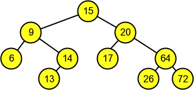

#### Código secuencial

Este código en C implementa la construcción de un árbol de búsqueda binaria (BST). A continuación una explicación detallada de cada parte del código:

- Estructura del nodo (struct Node): define una estructura Node que representa un nodo en el árbol de búsqueda binaria. Cada nodo tiene un dato entero (data) y dos punteros a nodos hijos izquierdo y derecho (left y right).

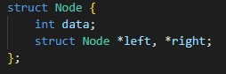

- Función de inserción (insert): la función insert recibe un árbol (root) y un dato entero (data) a insertar en el árbol. Si el árbol está vacío, crea un nuevo nodo con el dato y lo devuelve como la nueva raíz del árbol. Si el dato es menor que el valor en el nodo actual, se llama recursivamente a insert en el subárbol izquierdo. Si es mayor, se llama recursivamente en el subárbol derecho. Luego devuelve la raíz del árbol actualizado después de la inserción.

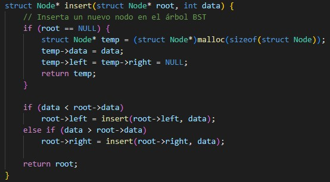

- Recorrido inorden (inOrder): la función inOrder realiza un recorrido inorden del árbol, escribiendo los datos en un archivo de salida. Primero el subárbol izquierdo, luego el nodo actual y finalmente el subárbol derecho.

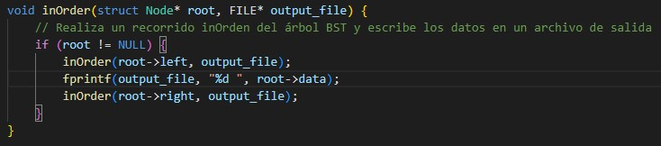
  
- Función principal (main): esta función hace lo siguiente 
  - Declara e inicializa la raíz del árbol como NULL.
  - Cuenta el número de elementos en el archivo "numeros_aleatorios.txt" para determinar el tamaño del arreglo data.
  - Lee los datos desde el archivo y los almacena en un arreglo dinámico (data).
  - Mide el tiempo de construcción del árbol en modo secuencial utilizando la función clock.
  - Imprime el tiempo de construcción en segundos.
  - Almacena los resultados (recorrido inorden) en un nuevo archivo de texto llamado "salidasecuencial.txt".
  - Libera la memoria del arreglo data.
 
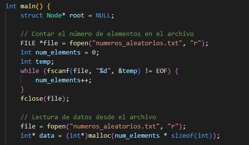

  
#### Código paralelo (con OpenMP)

En está nueva versión el código organiza el árbol paralelamente mediante la construcción de subárboles en paralelo utilizando OpenMP. La función insertBatch es clave para este proceso. 

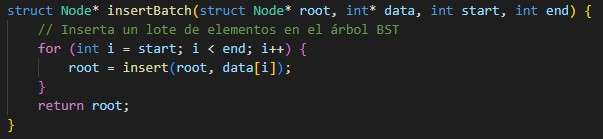

Esta función divide el conjunto total de datos en lotes y asigna cada lote a un hilo diferente. Cada hilo construye su propio subárbol mediante la función insert, y luego los subárboles se combinan para formar el árbol final. #pragma omp parallel se utiliza para crear un equipo de hilos que trabajará en la construcción del árbol en paralelo. Y #pragma omp single se utiliza para asegurarse de que la construcción del árbol se realice solo por un hilo.

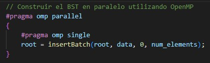

# Instrucciones de compilación y ejecución 

Para compilar y ejecutar el código en el clúster de GUANE-1, siga las siguientes instrucciones:

1. Entre en GUANE-1 con sus respectivas credenciales y ejecute los siguientes comandos:
  ```
  ssh guane
  ```
  ```
  srun -n 8 --pty /bin/bash
  ```

2. Cargue los archivos "numeros.c", "BSTSecuencial.c" y "BSTParalelo.c".

3. Compile y ejecute el programa "numeros.c" utilizando los siguientes comandos:

  ```
  gcc numeros.c -std=c99 -o numeros
  ```
  ```
  ./numeros
  ```
Luego de compilar y ejecutar este codigo se deberia generar un archivo llamado "numeros_aleatorios.txt" que sera utilizado por los códigos "BSTSecuencial" y "BSTParalelo" para posteriormente ordenarlos. 

El código "numeros.c" puede ser modificado para aumentar o disminuir los números generados. 

4. Para compilar y ejecutar el programa "BSTSecuencial" utiliza los siguientes comandos:

  ```
  gcc BSTSecuencial.c -std=c99 -o BSTSecuencial
  ```
  ```
  ./BSTSecuencial
  ```
Al final este generara un archivo llamado "salidaSecuencial.txt" en donde apareceran los números ordenados. 

5. Para compilar y ejecutar el programa "BSTParalelo" utiliza los siguientes comandos:

  ```
  gcc -fopenmp BSTParalelo.c -std=c99 -o BSTParalelo
  ```
  ```
  ./BSTParalelo
  ```
Al final este generara un archivo llamado "salidaParalelo.txt" en donde apareceran los números ordenados. 

# Resultados obtenidos 

#### Con 10.000 números

- Secuencial:

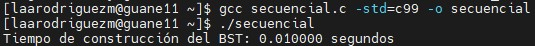

- Paralelo:

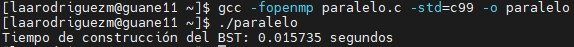

#### Con 100.000 números

- Secuencial:

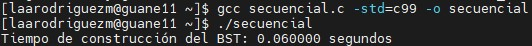

- Paralelo:

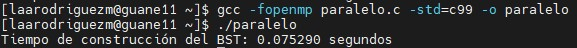

#### Con 1.000.000 números 

- Secuencial:

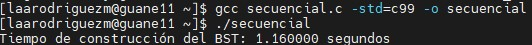

- Paralelo:

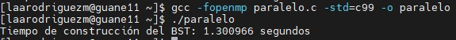

#### Con 10.000.000 números 

- Secuencial:

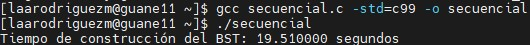

- Paralelo:

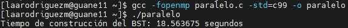

#### Con 20.000.000 números 

- Secuencial:

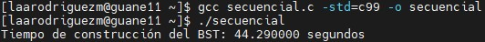

- Paralelo:

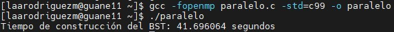

#### Con 100.000.000 números 

- Secuencial:

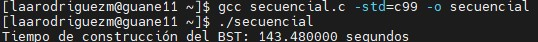

- Paralelo:

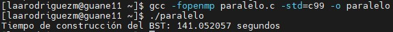

# Análisis de resultados 
# Conclusiones 
